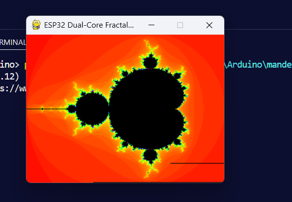
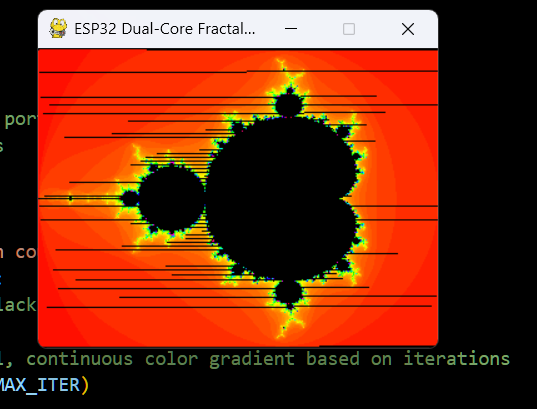

# ESP32 MandelbrotSet Creator and Visualiser
Creating the Mandelbrot Set on ESP32 and using python to view the result 

<<<<<<< Updated upstream

=======
Mutex and Atomic approach take nearly the same time with mutex edging out a win by 0.1-0.2 seconds during my testing

>>>>>>> Stashed changes
